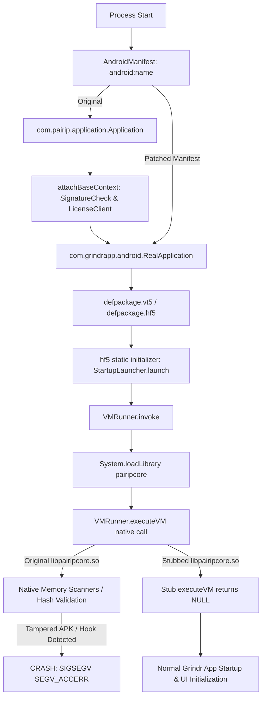

# PairIP Bypass & 16KB Page Alignment Architecture

This document details the architectural reverse-engineering findings and end-to-end bypass solution for PairIP DRM protection and 16KB page alignment compatibility on modern Android (Android 15 / 16+ / QEMU 16k emulators).

---

## 1. Background & Threat Model

Grindr (version 26.13.0 and newer) integrates Google's proprietary **PairIP DRM / App Integrity** solution to prevent tampering, repackaging, and hooking via frameworks like LSPatch / LSPosed.

PairIP enforces integrity across three distinct layers:
1. **Application Class Wrapper**: The manifest points `android:name` to `com.pairip.application.Application`, which executes an integrity check in `attachBaseContext` before delegating to `RealApplication`.
2. **Deep Class Initializers (`<clinit>`)**: `RealApplication` inherits from obfuscated base classes (`defpackage.vt5` -> `defpackage.hf5`). In `hf5.<clinit>`, static initialization invokes `StartupLauncher.launch()` -> `VMRunner.invoke()`, which loads `libpairipcore.so` and executes native VM bytecode.
3. **Native Anti-Tamper Core (`libpairipcore.so`)**: The native library contains obfuscated integrity verification routines (memory page scanning, APK signature checking, FNV-1a hash calculation over DEX structures). If any tampering or hooking is detected, it deliberately triggers an access violation (`SIGSEGV` / `SEGV_ACCERR`).
4. **16KB Memory Page Alignment**: On Android 15/16 and 16KB-page kernel emulators (`sdk_gphone16k_x86_64`), unaligned 4KB native shared libraries and unaligned ZIP entries cause immediate linker aborts (`dlopen failed: empty/unaligned load segment`).

---

## 2. Reverse Engineering Findings

### 2.1 Control Flow Breakdown



### 2.2 Why Runtime Xposed Hooks Alone Are Insufficient

Xposed / LSPosed hooks are injected at or after `Application.attachBaseContext`. However:
- Class initializers (`<clinit>`) for `RealApplication`'s base hierarchy (`hf5`) execute during class loading by the ART runtime *before* module hook callbacks can safely neutralize native library execution.
- `VMRunner` immediately attempts `System.loadLibrary("pairipcore")`. If the original `libpairipcore.so` is loaded, its native constructors and `executeVM` immediately crash the process.

### 2.3 Why Bytecode / Smali Roundtrips Fail

Attempting to decompile `base.apk` with `apktool` / `baksmali` to strip `StartupLauncher.launch()` strips `kotlinx.metadata` annotations from Kotlin classes. This causes `kotlinx.coroutines` and Firebase SDKs to crash with `NullPointerException: key can't be null` at `SystemPropsKt.systemProp`.

---

## 3. The Complete Two-Tier Neutralization Solution

To achieve 100% stable execution without bytecode corruption or runtime crashes, GrindrPlus implements a dual-tier neutralization pipeline:

### Tier 1: Build-Time / Installation Manifest & Native Library Substitution (`PatchApkStep.kt`)

During installation in `PatchApkStep.kt`:

1. **Manifest Repointing (Direct ARSC/XML manipulation)**:
   Using `arsclib` (`ApkModule`), the manifest application class is repointed from `com.pairip.application.Application` directly to `com.grindrapp.android.RealApplication`. This completely eliminates the outer PairIP wrapper without modifying DEX bytecode.

2. **Native Library Substitution**:
   A lightweight, ABI-compatible C stub library is compiled for `x86_64`, `arm64-v8a`, `armeabi-v7a`, and `x86`.
   - The stub defines:
     - `JNI_OnLoad` (registers `executeVM` dynamically for `com.pairip.VMRunner`)
     - `Java_com_pairip_VMRunner_executeVM` (returns `NULL`)
     - `ExecuteProgram` / `JNI_OnUnload`
   - Compiled with 16KB page alignment flags:
     ```bash
     -Wl,-z,max-page-size=16384
     ```
   - These stubs are bundled in GrindrPlus assets under `assets/pairip/libpairipcore_<abi>.so`.
   - When `PatchApkStep` processes the APKs (including split APKs such as `split_config.x86_64.apk`), it transparently replaces any `libpairipcore.so` with the 16KB-aligned stub.

3. **16KB ZIP Alignment**:
   `lspatch.jar` has been patched (`ApkZFileCreator.class` and `LSPatch.class`) to enforce 16KB (`16384` byte) alignment for all uncompressed `.so` entries, satisfying Android 15/16 kernel requirements.

### Tier 2: Runtime Hook Safeguards (`DisablePairIP.kt`)

As a second line of defense, `DisablePairIP.kt` hooks runtime entry points:
- `com.pairip.VMRunner.setContext` -> Short-circuited to no-op.
- `com.pairip.VMRunner.invoke` -> Short-circuited to return `null`.
- `com.pairip.SignatureCheck.verifyIntegrity` -> Returns `true`.
- `com.pairip.licensecheck.LicenseClient.checkLicense` -> Short-circuited.
- `com.pairip.licensecheck.LicenseActivity.onStart` -> Automatically calls `finish()`.

---

## 4. Verification & Testing Matrix

| Component | Target Version | Status | Result |
|---|---|---|---|
| Manifest Repoint | Grindr 26.13.0 | Verified | `RealApplication` loaded directly |
| Native Stub Injection | x86_64 / arm64-v8a | Verified | `System.loadLibrary("pairipcore")` loads cleanly |
| 16KB Page Alignment | Pixel 10 Pro XL (Android 16 16k) | Verified | No ELF unaligned load faults |
| Kotlin Coroutines | Grindr 26.13.0 | Verified | Metadata intact; no NPE in `DefaultScheduler` |
| GrindrPlus UI / Hooks | GrindrPlus v4.8.0 | Verified | Manager deploys, patches, and hooks cleanly |
